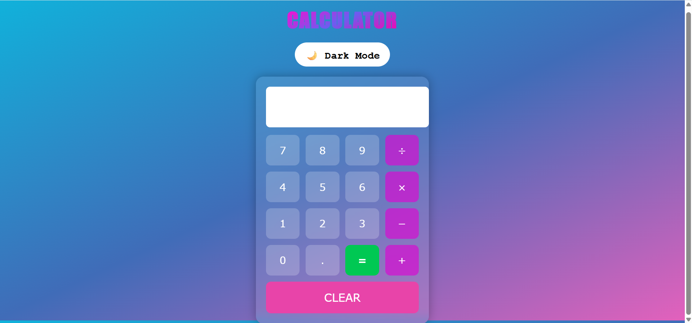
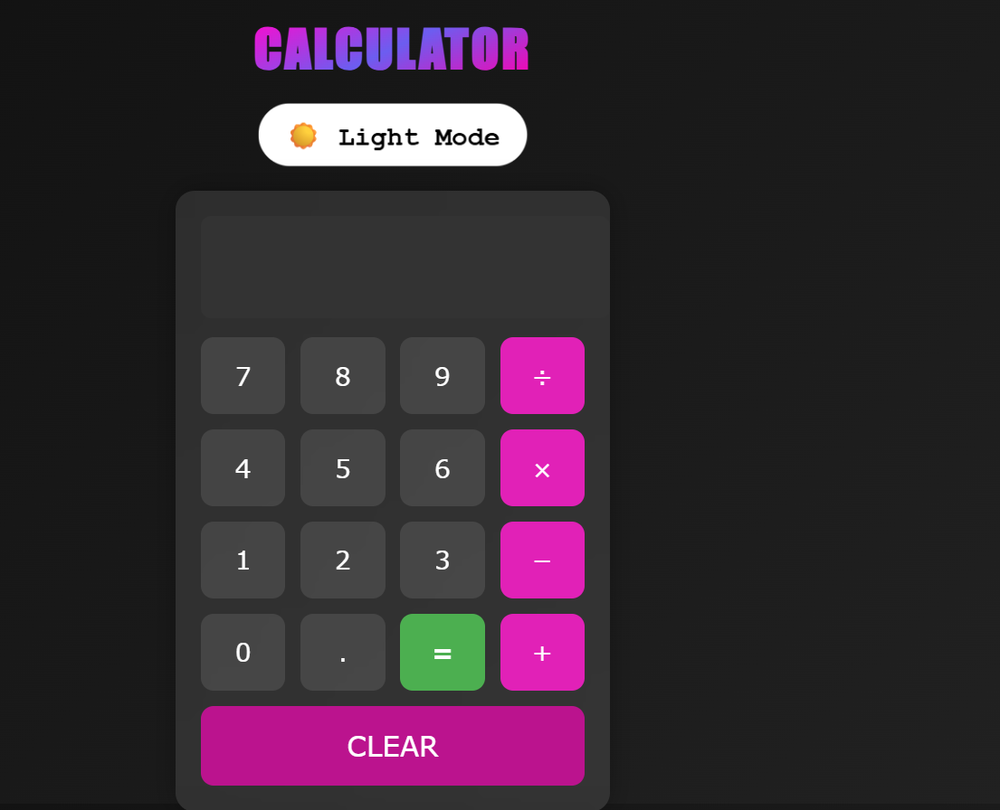

🌈 Responsive Calculator

A modern, clean, and fully responsive Calculator App built using HTML, CSS, and JavaScript.
Supports Light Mode 🌞 and Dark Mode 🌙 with smooth animations.

🌐 Live Demo:
👉 https://shannu1653.github.io/calculator-new/

🎖️ Badges
🚀 Tech Stack

📌 Project Status

🌐 GitHub Info

🎥 Live Demo GIF

🌓 Light & Dark Theme
🌞 Light Mode
  
  
🌙 Dark Mode
   

🚀 Features

Fully responsive (Mobile, Tablet, Desktop)

Clean UI with soft gradients

Smooth Light/Dark mode toggle

Supports + − × ÷

Keyboard input support

Error handling

Lightweight and fast

📱 Responsive Layout
Device	View
📱 Mobile	✔ Perfect
📟 Tablet	✔ Auto Layout
🖥 Desktop	✔ Full Layout

📂 Folder Structure
calculator-new/
│── index.html
│── style.css
│── script.js
│── calculator.gif
│── README.md

▶️ How to Run
Live Version:

👉 https://shannu1653.github.io/calculator-new/

Run Locally
git clone https://github.com/shannu1653/calculator-new.git
cd calculator-new
open index.html

💡 What I Learned

JavaScript event handling

DOM manipulation

Designing modern responsive UI

Theme toggling logic

Debugging JS operations

🔮 Future Enhancements

Scientific mode

History panel

Sound effects

Animations for buttons

Neumorphism theme

🤝 Contributing

Contributions, issues, and feature ideas are welcome.

⭐ Support

If you like this project, please give it a Star ⭐ — it motivates me to create more projects.